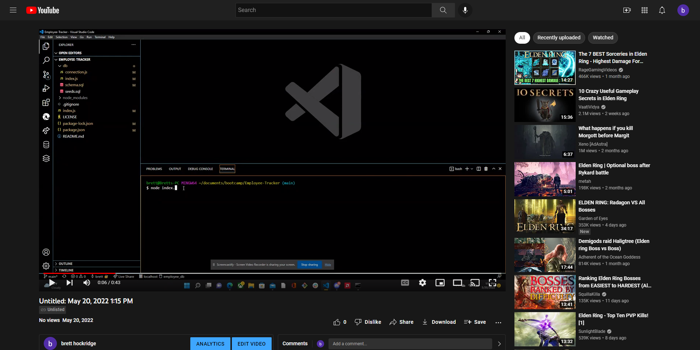

# Employee-Tracker
---

 

## Description:
---
Build a command-line application from scratch to manage a company's employee database, using Node.js, Inquirer, and MySQL. 

 
 

## Table of Contents:
---
- [Video](#video)
- [Installation](#installation)
- [Contribute](#contribute)
- [Test](#test)
- [Author](#author)

 
 

## Video:
---

 
 

## Installation:
---
You can clone my github repository at https://github.com/BroBrett/Employee-Tracker

 
 

## Contribution:
---
If you wish to contribute please email me at brettstephenhockridge@yahoo.com

 
 

## Test:
---
Install MySQL to your computer, then npm install inquirer, mysql2, console.table and nodemon. Once they're installed, run node index.js in the terminal.

 
 

## Author:
---
Brett Hockridge
- Thank you to BCS and teachers Jackie and Dave,